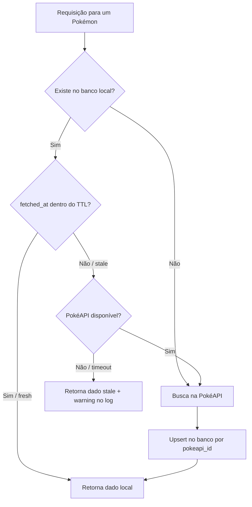

# Arquitetura

## Escolha Arquitetural: Clean / Hexagonal Architecture

O projeto adota os princípios da **Clean Architecture** (Robert C. Martin) com influências da **Arquitetura Hexagonal** (Ports & Adapters — Alistair Cockburn). A regra central é a **Dependency Rule**: dependências sempre apontam para dentro — camadas externas dependem de camadas internas, nunca o contrário.

```
Presentation → Application → Domain ← Infrastructure
```

A camada de **Domain** é o núcleo: contém entidades, ports (interfaces) e exceções, e **não importa nada de NestJS, TypeORM ou qualquer framework externo**. Isso permite testar a lógica de negócio com mocks simples, sem precisar subir banco ou servidor HTTP.

### Por que essa arquitetura?

| Decisão | Alternativa considerada | Motivo da escolha |
|---|---|---|
| Clean / Hexagonal | MVC simples (controller → service → repository) | Separa claramente o que é regra de negócio do que é detalhe de infraestrutura. Use cases são testáveis com mocks, sem framework. |
| Ports como interfaces no Domain | Injetar o repositório TypeORM diretamente no use case | O use case não sabe que existe TypeORM ou PostgreSQL. Trocar o banco de dados não exige tocar na lógica de negócio. |
| Use Cases como classes com responsabilidade única | Services NestJS com múltiplas responsabilidades | Cada use case faz uma coisa só. Fica fácil de ler, testar e evoluir sem medo de quebrar outro fluxo. |
| Exceções de domínio como classes TypeScript puras | Lançar `HttpException` do NestJS dentro do domínio | O domínio não sabe que existe HTTP. O `GlobalExceptionFilter` na camada de Presentation faz o mapeamento para status codes. |

---

## Estrutura de Pastas

```
src/
├── domain/                        # Núcleo — zero dependências de framework
│   ├── trainer/
│   │   ├── trainer.entity.ts
│   │   ├── trainer.repository.port.ts
│   │   └── value-objects/cep.vo.ts      # Validação de CEP via regex puro
│   ├── team/
│   ├── pokemon/
│   │   ├── pokemon.entity.ts
│   │   ├── pokemon-type.entity.ts       # Cache de efetividade de tipos
│   │   └── pokemon.repository.port.ts
│   ├── team-pokemon/
│   ├── ports/
│   │   ├── pokeapi.port.ts              # Interface para PokéAPI
│   │   └── viacep.port.ts               # Interface para ViaCEP
│   └── exceptions/                      # Hierarquia de erros pura
│
├── application/                   # Use cases — orquestram domínio e ports
│   ├── di/tokens.ts                # Tokens de composição, fora do Domain
│   ├── ports/                      # Ports transversais de aplicação
│   ├── trainer/use-cases/
│   ├── team/use-cases/
│   └── pokemon/use-cases/
│
├── infrastructure/                # Adapters — implementam os ports do domínio
│   ├── database/
│   │   ├── typeorm/
│   │   │   ├── entities/            # ORM entities (@Entity, @Column)
│   │   │   ├── repositories/        # Implementam RepositoryPort
│   │   │   ├── mappers/             # OrmEntity ↔ DomainEntity
│   │   │   ├── *-persistence.module.ts # Bindings Nest dos adapters TypeORM
│   │   │   └── migrations/          # Migrations TypeORM (synchronize: false)
│   │   └── data-source.ts           # DataSource para CLI de migrations
│   ├── config/                      # Adapters de configuração
│   ├── http-clients/
│       ├── pokeapi/                 # Implementa PokeApiPort
│       └── viacep/                  # Implementa ViaCepPort
│   ├── logging/                     # Adapter de logging
│   └── modules/                     # Composição Nest dos use cases via factories
│
├── presentation/                  # Controllers, DTOs, Guards, Filters
│   ├── trainer/
│   ├── team/
│   ├── pokemon/
│   └── health/
│
└── shared/
    ├── filters/global-exception.filter.ts   # DomainException → HTTP
    ├── guards/api-key.guard.ts
    ├── pipes/validation.pipe.ts
    └── interceptors/logging.interceptor.ts
```

### Co-localização de testes

Testes unitários e de integração ficam **ao lado dos arquivos que testam**, não em uma pasta `test/` separada:

```
src/application/trainer/use-cases/create-trainer.use-case.ts
src/application/trainer/use-cases/create-trainer.use-case.spec.ts   ← unit test

src/infrastructure/database/typeorm/repositories/trainer.typeorm-repository.ts
src/infrastructure/database/typeorm/repositories/trainer.typeorm-repository.int-spec.ts   ← integration test
```

Testes E2E (fluxo completo via HTTP) ficam em `test/e2e/`.

---

## Camadas — Diagrama

```mermaid
flowchart TD
    subgraph PRESENTATION["Presentation Layer (Controllers + DTOs)"]
        TC[TrainerController]
        TEC[TeamController]
        PC[PokemonController]
        HC[HealthController]
    end

    subgraph APPLICATION["Application Layer (Use Cases)"]
        CT[CreateTrainerUseCase]
        GetT[GetTrainerUseCase]
        UT[UpdateTrainerUseCase]
        ECE[EnrichTrainerCepUseCase]
        DTR[DeleteTrainerUseCase]
        RRT[RestoreTrainerUseCase]

        CTE[CreateTeamUseCase]
        GetTE[GetTeamUseCase]
        UTE[UpdateTeamUseCase]
        DTE[DeleteTeamUseCase]
        APT[AddPokemonToTeamUseCase]
        RPT[RemovePokemonFromTeamUseCase]
        ATA[AnalyzeTeamTypesUseCase]

        GOP[GetOrFetchPokemonUseCase]
        LP[ListPokemonUseCase]
    end

    subgraph DOMAIN["Domain Layer (Entities + Ports)"]
        TE[TrainerEntity]
        TME[TeamEntity]
        PE[PokemonEntity]
        TRP[TrainerRepositoryPort]
        TMP[TeamRepositoryPort]
        PP[PokemonRepositoryPort]
        VP[ViaCepPort]
        PAP[PokeApiPort]
        ERR[DomainExceptions]
    end

    subgraph INFRASTRUCTURE["Infrastructure Layer (Adapters)"]
        TORM[TrainerTypeOrmRepository]
        TEORM[TeamTypeOrmRepository]
        PORM[PokemonTypeOrmRepository]
        VIAC[ViaCepClient]
        PKAPI[PokeApiClient]
        PG[(PostgreSQL)]
        VCEP[ViaCEP API]
        PKEXT[PokéAPI]
    end

    TC --> CT & GetT & UT & ECE & DTR & RRT
    TEC --> CTE & GetTE & UTE & DTE & APT & RPT & ATA
    PC --> GOP & LP
    HC --> PG

    CT & GetT & UT & DTR & RRT --> TRP
    ECE --> TRP
    ECE --> VP
    CTE & GetTE & UTE & DTE & ATA --> TMP
    APT & RPT --> TMP
    APT & GOP & LP --> PP
    ATA --> PAP

    TRP -.-> TORM
    TMP -.-> TEORM
    PP -.-> PORM
    VP -.-> VIAC
    PAP -.-> PKAPI

    TORM & TEORM & PORM --> PG
    VIAC --> VCEP
    PKAPI --> PKEXT
```



> Setas sólidas → dependência direta. Setas tracejadas → inversão de dependência via interface (Port).

---

## Estratégia de Cache — PokéAPI



- **TTL configurável** via `POKEMON_TTL_HOURS` (padrão: 24h)
- **Fallback resiliente**: se a PokéAPI estiver fora do ar mas o dado existir localmente (mesmo que expirado), a API retorna o dado stale com um warning no log — nunca 503. Um 502 só acontece se não houver dado local algum.
- **Upsert por `pokeapi_id`**: idempotente — chamar o mesmo pokémon duas vezes não cria duplicatas.
- **Cache de tipos** (`POKEMON_TYPES`): efetividade de tipos para o endpoint `/analysis` tem TTL próprio de 7 dias (`POKEMON_TYPE_TTL_DAYS`) — tipos mudam muito raramente.

---

## Principais Bibliotecas e Decisões

| Biblioteca | Versão | Decisão |
|---|---|---|
| `@nestjs/core` | 10 | Framework principal — provê DI, módulos, guards, interceptors e pipes com convenções claras. |
| `typeorm` | 0.3 | ORM escolhido conforme requisito. `synchronize: false` em todos os ambientes — o schema evolui exclusivamente via migrations versionadas. |
| `axios` | — | HTTP client para PokéAPI e ViaCEP. Configurado com timeout (`HTTP_TIMEOUT_MS`) e tratamento de erro por status code, com propagação para as exceções do domínio. |
| `class-validator` + `class-transformer` | — | Validação e transformação de DTOs na camada de Presentation. O Domain usa sua própria validação (`CepVO`) sem depender de nenhuma biblioteca. |
| `@nestjs/swagger` | — | Documentação OpenAPI 3.0 gerada automaticamente a partir dos decorators nos controllers e DTOs. |
| `@nestjs/terminus` | — | Health check com verificação real de conectividade do banco (`GET /api/health`). |
| `@nestjs/throttler` | — | Rate limiting: 100 requisições por minuto por IP. |
| `helmet` | — | Headers de segurança HTTP (X-Frame-Options, X-Content-Type-Options, etc.). CSP ajustado para não forçar upgrade HTTP→HTTPS em localhost, evitando problemas no Safari. |
| `joi` | — | Validação do schema de variáveis de ambiente na inicialização. A aplicação não sobe se `API_KEYS` estiver vazio ou mal formado. |
| `jest` + `ts-jest` | — | Três configs separadas: unit (`jest.config.ts`), integration (`jest.integration.config.ts`), E2E (`jest.e2e.config.ts`). |
| `supertest` | — | Requisições HTTP nos testes E2E contra o `AppModule` completo. |
| `pg` | — | Driver PostgreSQL direto, usado no `globalSetup` de testes para criar e dropar o schema `test`. |

### Decisões de estrutura notáveis

**`CepVO` — Value Object puro**
A validação do formato de CEP (regex de 8 dígitos) é implementada como uma classe TypeScript simples, sem `class-validator`. O Domain não sabe que existe uma biblioteca de validação HTTP — o VO é testável de forma completamente isolada e pode ser reutilizado fora do contexto NestJS. Se a validação fosse feita só no DTO (Presentation), a regra ficaria amarrada ao framework.

**Mappers na camada de Infrastructure**
A conversão entre `OrmEntity` (objeto do TypeORM, cheio de decorators `@Column` e `@Entity`) e `DomainEntity` (POJO simples com lógica de negócio) acontece nos mappers em `infrastructure/database/typeorm/mappers/`. O Domain nunca vê anotações do TypeORM, e a Infrastructure nunca expõe objetos de domínio diretamente ao banco. Isso permite, por exemplo, mudar o tipo de uma coluna no banco sem tocar no Domain.

**`APP_GUARD` global para API Key**
O `ApiKeyGuard` é registrado como guard global no `AppModule`. Rotas públicas (`/api/health` e o Swagger em `/api`) recebem o decorator `@Public()` para opt-out explícito. A consequência prática: qualquer novo endpoint criado fica protegido por padrão, sem precisar lembrar de adicionar um guard — o esquecimento é seguro.

**Use cases sem decorators de framework**
Os use cases são classes TypeScript puras: recebem interfaces no construtor e não usam `@Inject`, `ConfigService`, `Logger` ou `DataSource` diretamente. A composição com tokens do Nest acontece nos módulos em `infrastructure/modules/`, usando factories explícitas. Assim, a camada de Application continua testável sem container Nest e sem dependência de infraestrutura.

**Configuração, logging e transações como adapters**
TTL de cache e logging entram nos use cases por ports (`PokemonCacheConfigPort`, `LoggerPort`), implementados na infraestrutura. Operações transacionais de banco, como soft delete em cascata de treinador e times, ficam nos repositórios TypeORM; o use case apenas aciona a operação de aplicação exposta pelo port.

**Migrations como único mecanismo de schema**
`synchronize: false` em todos os ambientes, inclusive local. O schema evolui apenas via migrations TypeORM versionadas e commitadas no Git. Isso elimina a classe de bugs onde o banco de desenvolvimento diverge silenciosamente do de produção, e torna o histórico de schema rastreável junto com o código.

---

## Hierarquia de Erros de Domínio

Exceções são classes TypeScript puras, sem dependências de framework. O `GlobalExceptionFilter` na camada de Presentation intercepta qualquer exceção não tratada e a converte para a resposta HTTP apropriada.

```
DomainException (abstract, extends Error)
├── TeamFullException           → 422 Unprocessable Entity
├── DuplicatePokemonException   → 409 Conflict
├── TeamArchivedException       → 422 Unprocessable Entity
├── InvalidCepException         → 400 Bad Request
└── EmailConflictException      → 409 Conflict

ResourceNotFoundException       → 404 Not Found   (extends Error diretamente)
ExternalServiceException        → 502 Bad Gateway  (extends Error diretamente)
CepNotFoundExternalException    → 404 Not Found    (extends Error diretamente)
```

`DomainException` agrupa erros causados por violação de regra de negócio — o cliente fez algo inválido. As três exceções soltas (`ResourceNotFoundException`, `ExternalServiceException`, `CepNotFoundExternalException`) representam situações que não são exatamente "regra violada", mas sim recursos ausentes ou serviços externos com problema, por isso não herdam de `DomainException`.

---

## Integrações externas

| Serviço | Endpoint | Uso |
|---------|----------|-----|
| **PokéAPI** | `/pokemon/:name` | Busca e cache de dados de pokémon |
| **PokéAPI** | `/type/:name` | Cache de efetividade de tipos para `/analysis` |
| **ViaCEP** | `/:cep/json/` | Enriquecimento de endereço por CEP (apenas endereços brasileiros) |

---

## Banco de dados

- `synchronize: false` em todos os ambientes — somente migrations
- Soft delete (`deleted_at`) em Trainers e Teams via `@DeleteDateColumn`
- Índice único parcial em `trainers(email) WHERE deleted_at IS NULL` — permite restore sem conflito de e-mail
- `UNIQUE(team_id, pokemon_id)` e `UNIQUE(team_id, slot)` em `team_pokemon`
- Ver modelo completo e decisões de modelagem em [erd.md](erd.md)
