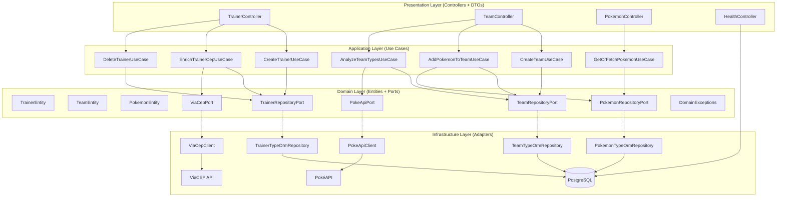
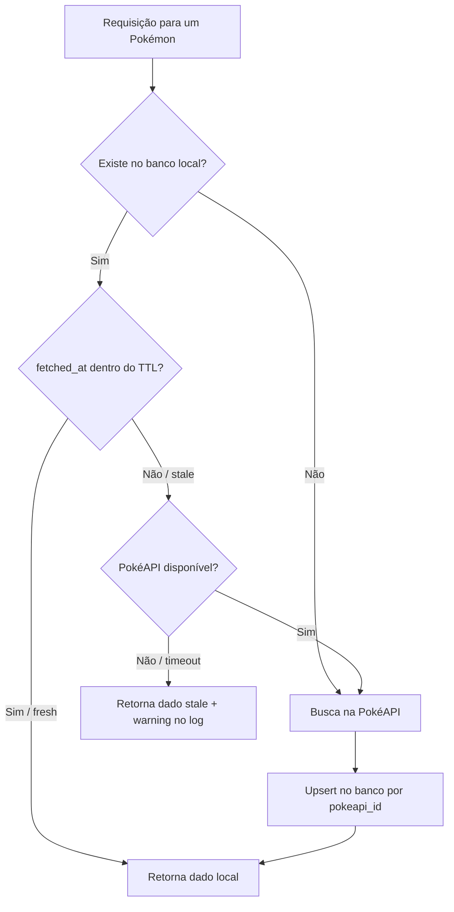

# Arquitetura

## Camadas



> A camada de **Domain** não possui nenhuma dependência de framework (sem imports de NestJS). Ports são interfaces — as implementações ficam em Infrastructure.

---

## Estratégia de Cache — PokéAPI



- **TTL configurável** via `POKEMON_TTL_HOURS` (padrão: 24h)
- **Fallback resiliente**: se a PokéAPI estiver indisponível mas houver dado local (mesmo stale), a API responde com o dado antigo e loga um warning — nunca retorna 503 quando há cache
- **Upsert por `pokeapi_id`**: garante idempotência e evita duplicatas entre variantes do mesmo pokémon
- **Cache de tipos** (`POKEMON_TYPES`): efetividade de tipos para `/analysis` é cacheada separadamente com TTL de 7 dias (`POKEMON_TYPE_TTL_DAYS`) — tipos raramente mudam

---

## Hierarquia de Erros de Domínio

Exceções de domínio são classes TypeScript puras, sem dependências de framework. O `GlobalExceptionFilter` mapeia para HTTP:

```
DomainException
├── TeamFullException           → 422 Unprocessable Entity
├── DuplicatePokemonException   → 409 Conflict
├── TeamArchivedException       → 422 Unprocessable Entity
└── InvalidCepException         → 400 Bad Request

ResourceNotFoundException       → 404 Not Found
CepNotFoundExternalException    → 404 Not Found
ExternalServiceException        → 502 Bad Gateway
```
