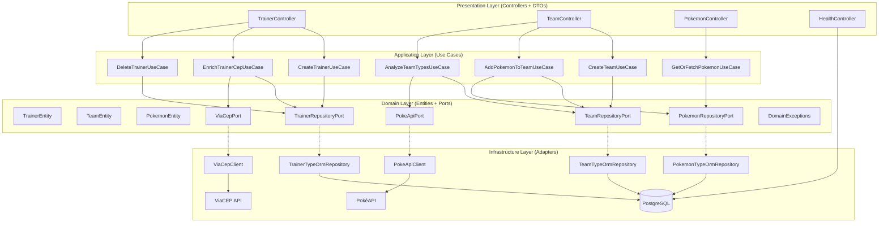
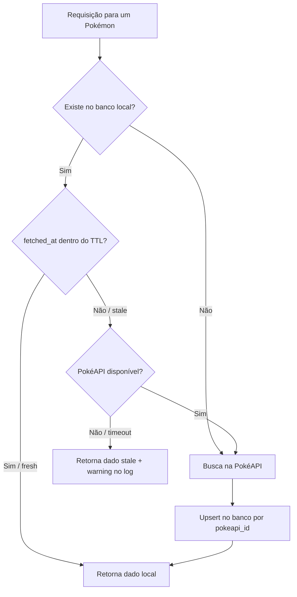

# Arquitetura

## Escolha Arquitetural: Clean / Hexagonal Architecture

O projeto adota os princípios da **Clean Architecture** (Robert C. Martin) com influências da **Arquitetura Hexagonal** (Ports & Adapters — Alistair Cockburn). A regra central é a **Dependency Rule**: dependências só apontam para dentro — camadas externas dependem de camadas internas, nunca o contrário.

```
Presentation → Application → Domain ← Infrastructure
```

A camada de **Domain** é o núcleo: contém entidades, ports (interfaces) e exceções, e **não importa nada de NestJS, TypeORM ou qualquer framework**. Isso permite testar a lógica de negócio com mocks simples, sem subir banco ou HTTP.

### Por que essa arquitetura?

| Decisão | Alternativa considerada | Motivo da escolha |
|---|---|---|
| Clean / Hexagonal | MVC simples (controller → service → repository) | Separação clara entre regra de negócio e infraestrutura; use cases testáveis sem framework |
| Ports como interfaces no Domain | Injetar repositório TypeORM diretamente no use case | Evita acoplamento ao ORM; fácil trocar PostgreSQL por outro banco sem tocar a lógica |
| Use Cases como classes | Services NestJS com lógica misturada | Cada use case tem responsabilidade única; facilita leitura, teste e evolução independente |
| Exceções de domínio puras | `HttpException` do NestJS no domínio | Domínio não sabe que existe HTTP; o `GlobalExceptionFilter` faz o mapeamento |

---

## Estrutura de Pastas

```
src/
├── domain/                        # Núcleo — zero dependências de framework
│   ├── trainer/
│   │   ├── trainer.entity.ts
│   │   ├── trainer.repository.port.ts
│   │   └── value-objects/cep.vo.ts      # Validação de CEP via regex puro
│   ├── team/
│   ├── pokemon/
│   │   ├── pokemon.entity.ts
│   │   ├── pokemon-type.entity.ts       # Cache de efetividade de tipos
│   │   └── pokemon.repository.port.ts
│   ├── team-pokemon/
│   ├── ports/
│   │   ├── pokeapi.port.ts              # Interface para PokéAPI
│   │   └── viacep.port.ts               # Interface para ViaCEP
│   └── exceptions/                      # Hierarquia de erros pura
│
├── application/                   # Use cases — orquestram domínio e ports
│   ├── trainer/use-cases/
│   ├── team/use-cases/
│   └── pokemon/use-cases/
│
├── infrastructure/                # Adapters — implementam os ports do domínio
│   ├── database/
│   │   ├── typeorm/
│   │   │   ├── entities/            # ORM entities (@Entity, @Column)
│   │   │   ├── repositories/        # Implementam RepositoryPort
│   │   │   ├── mappers/             # OrmEntity ↔ DomainEntity
│   │   │   └── migrations/          # Migrations TypeORM (synchronize: false)
│   │   └── data-source.ts           # DataSource para CLI de migrations
│   └── http-clients/
│       ├── pokeapi/                 # Implementa PokeApiPort
│       └── viacep/                  # Implementa ViaCepPort
│
├── presentation/                  # Controllers, DTOs, Guards, Filters
│   ├── trainer/
│   ├── team/
│   ├── pokemon/
│   └── health/
│
└── shared/
    ├── filters/global-exception.filter.ts   # DomainException → HTTP
    ├── guards/api-key.guard.ts
    ├── pipes/validation.pipe.ts
    └── interceptors/logging.interceptor.ts
```

### Co-localização de testes

Testes unitários e de integração ficam **ao lado dos arquivos que testam**, não em uma pasta `test/` separada:

```
src/application/trainer/use-cases/create-trainer.use-case.ts
src/application/trainer/use-cases/create-trainer.use-case.spec.ts   ← unit test

src/infrastructure/database/typeorm/repositories/trainer.typeorm-repository.ts
src/infrastructure/database/typeorm/repositories/trainer.typeorm-repository.int-spec.ts   ← integration test
```

Testes E2E (fluxo completo via HTTP) ficam em `test/e2e/`.

---

## Camadas — Diagrama



> Setas sólidas → dependência direta. Setas tracejadas → inversão de dependência via interface (Port).

---

## Estratégia de Cache — PokéAPI



- **TTL configurável** via `POKEMON_TTL_HOURS` (padrão: 24h)
- **Fallback resiliente**: PokéAPI indisponível + dado local existente → retorna stale + warning, nunca 503
- **Upsert por `pokeapi_id`**: idempotente, evita duplicatas entre variantes do mesmo pokémon
- **Cache de tipos** (`POKEMON_TYPES`): efetividade de tipos para `/analysis` com TTL próprio de 7 dias (`POKEMON_TYPE_TTL_DAYS`)
- **Redis não adotado**: PostgreSQL local já serve como cache. Redis seria justificado com múltiplos pods e alta concorrência — adição futura sem refatoração de arquitetura

---

## Principais Bibliotecas e Decisões

| Biblioteca | Versão | Decisão |
|---|---|---|
| `@nestjs/core` | 10 | Framework principal — DI, módulos, guards, interceptors, pipes |
| `typeorm` | 0.3 | ORM escolhido conforme requisito. `synchronize: false` em todos os ambientes — somente migrations |
| `axios` | — | HTTP client para PokéAPI e ViaCEP. Configurado com timeout (`HTTP_TIMEOUT_MS`) e tratamento de erro por status |
| `class-validator` + `class-transformer` | — | Validação e transformação de DTOs na camada de Presentation. Domínio usa validação própria (`CepVO`) sem dependência de framework |
| `@nestjs/swagger` | — | Documentação OpenAPI 3.0 gerada automaticamente a partir dos decorators nos controllers e DTOs |
| `@nestjs/terminus` | — | Health check com verificação de conectividade do banco (`GET /api/health`) |
| `@nestjs/throttler` | — | Rate limiting: 100 req/min por IP |
| `helmet` | — | Headers de segurança HTTP. CSP ajustado para não forçar upgrade de HTTP→HTTPS em localhost (compatibilidade Safari) |
| `joi` | — | Validação do schema de variáveis de ambiente na inicialização. App não sobe se `API_KEYS` estiver vazio |
| `jest` + `ts-jest` | — | Três configs separadas: unit (`jest.config.ts`), integration (`jest.integration.config.ts`), E2E (`jest.e2e.config.ts`) |
| `supertest` | — | Requisições HTTP nos testes E2E contra o `AppModule` completo |
| `pg` | — | Driver PostgreSQL direto (usado no `globalSetup` de testes para criar/dropar o schema `test`) |

### Decisões de estrutura notáveis

**`CepVO` — Value Object puro**
Validação do formato de CEP (regex 8 dígitos) implementada como classe TypeScript sem `class-validator`. O domínio não sabe que existe uma biblioteca de validação de HTTP — o VO é testável de forma isolada e pode ser reutilizado fora do contexto NestJS.

**Mappers na camada de Infrastructure**
A conversão entre `OrmEntity` (TypeORM) e `DomainEntity` (POJO) acontece nos mappers em `infrastructure/database/typeorm/mappers/`. O domínio nunca vê decorators do TypeORM (`@Column`, `@Entity`) e a infraestrutura nunca expõe objetos de domínio com lógica de negócio diretamente ao banco.

**`APP_GUARD` global para API Key**
O `ApiKeyGuard` é registrado como guard global no `AppModule`. Rotas públicas (`/api/health`, Swagger) recebem o decorator `@Public()`. Isso garante que qualquer novo endpoint seja protegido por padrão — é necessário opt-out explícito, não opt-in.

**Migrations como único mecanismo de schema**
`synchronize: false` em todos os ambientes, inclusive local. O schema evolui apenas via migrations TypeORM versionadas. Isso evita divergências entre desenvolvimento e produção e torna o histórico de schema auditável via Git.

---

## Hierarquia de Erros de Domínio

Exceções de domínio são classes TypeScript puras, sem dependências de framework. O `GlobalExceptionFilter` mapeia para HTTP:

```
DomainException
├── TeamFullException           → 422 Unprocessable Entity
├── DuplicatePokemonException   → 409 Conflict
├── TeamArchivedException       → 422 Unprocessable Entity
└── InvalidCepException         → 400 Bad Request

ResourceNotFoundException       → 404 Not Found
CepNotFoundExternalException    → 404 Not Found
ExternalServiceException        → 502 Bad Gateway
```

---

## Estrutura de pastas

```
src/
├── domain/          # Entidades, ports, exceções — sem dependências de framework
├── application/     # Use cases — orquestram domínio e ports
├── infrastructure/  # TypeORM, HTTP clients (PokéAPI, ViaCEP), config
└── presentation/    # Controllers, DTOs, guards, filters
```

---

## Integrações externas

| Serviço | Endpoint | Uso |
|---------|----------|-----|
| **PokéAPI** | `/pokemon/:name` | Busca e cache de pokémon |
| **PokéAPI** | `/type/:name` | Cache de efetividade de tipos para `/analysis` |
| **ViaCEP** | `/:cep/json/` | Enriquecimento de endereço por CEP |

---

## Banco de dados

- `synchronize: false` em todos os ambientes — somente migrations
- Soft delete (`deleted_at`) em Trainers e Teams via `@DeleteDateColumn`
- Índice único parcial em `trainers(email) WHERE deleted_at IS NULL` — permite restore sem conflito de e-mail
- `UNIQUE(team_id, pokemon_id)` em `team_pokemon` — impede duplicatas no time
