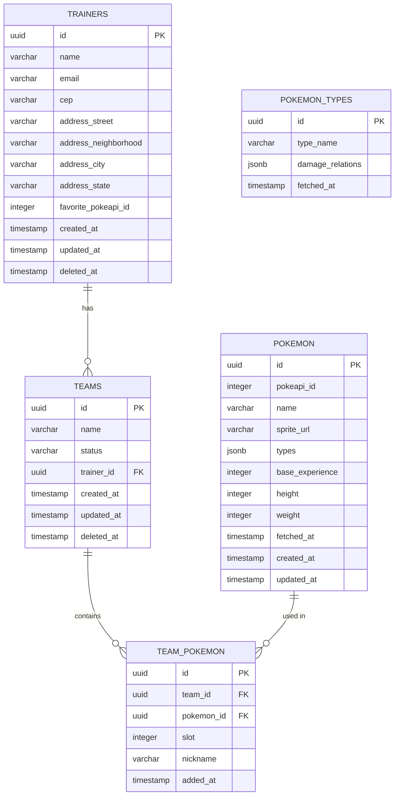

# Modelo de Banco de Dados (ERD)

## Decisões de modelagem

| Entidade | Decisão |
|----------|---------|
| `TRAINERS.deleted_at` | Soft delete via `@DeleteDateColumn`. Índice único parcial em `email WHERE deleted_at IS NULL` — permite restaurar sem conflito de email |
| `TEAMS.deleted_at` | Soft delete. Quando um Trainer é deletado, todos os seus times são soft-deletados em cascata (transação na aplicação) |
| `TEAMS.status` | `'active' \| 'archived'` — times arquivados não aceitam novos pokémon |
| `TEAM_POKEMON` | `UNIQUE(team_id, pokemon_id)` + máximo 5 slots por time validado via `COUNT(*) < 5`. Slots com buracos são permitidos (remover slot 3 não recompacta 4 e 5) |
| `POKEMON.pokeapi_id` | Chave de upsert — não o `name`, para evitar ambiguidade com variantes (ex: `deoxys-attack`) |
| `TRAINERS.favorite_pokeapi_id` | Inteiro sem FK — referência ao ID da PokéAPI, não à entidade local. Pokémon ainda não cacheado pode ser buscado via `GET /pokemon/:id` |
| `POKEMON_TYPES` | Tabela de cache de efetividade de tipos. Evita N chamadas externas por request de `/analysis` |
