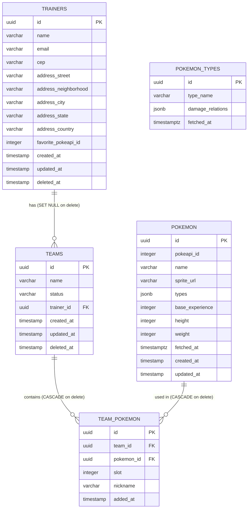

# Modelo de Banco de Dados (ERD)

---

## Decisões de modelagem

### TRAINERS

| Campo / Constraint | Decisão |
|---|---|
| `deleted_at` | Soft delete via `@DeleteDateColumn` do TypeORM. O registro nunca é apagado fisicamente — apenas marcado com a data de remoção. Isso preserva histórico e permite restore. |
| Índice único parcial em `email WHERE deleted_at IS NULL` | Garante unicidade de e-mail apenas entre treinadores ativos. Um e-mail "liberado" por soft delete pode ser reutilizado, e o treinador original pode ser restaurado sem conflito. Índice parcial em vez de `UNIQUE` simples porque o banco precisa ignorar registros já deletados. |
| `favorite_pokeapi_id` integer sem FK | Referência ao ID numérico da PokéAPI externa, não ao `id` interno da tabela `POKEMON`. Isso permite que o treinador favorite um pokémon que ainda não foi cacheado localmente — basta buscar via `GET /pokemon/:id` quando necessário. Uma FK exigiria que o pokémon existisse antes, o que quebraria o modelo de cache-on-demand. |
| `address_country` sempre `"BR"` | A integração ViaCEP cobre apenas endereços brasileiros, então o país é sempre Brasil. O campo existe para manter o modelo de endereço completo e estruturado, facilitando uma eventual expansão para outros países sem migration de schema. |
| `address_state` varchar(2) | Sigla de UF retornada pelo ViaCEP (ex: `"SP"`, `"RJ"`). Tamanho fixo de 2 caracteres. |

### TEAMS

| Campo / Constraint | Decisão |
|---|---|
| `deleted_at` | Soft delete. Times podem ser deletados de forma independente ou em cascata quando o treinador é deletado. O `deleted_at` idêntico ao do treinador é usado para distinguir as duas situações no restore (ver `business-rules.md`). |
| `trainer_id FK ON DELETE SET NULL` | Se um treinador for removido via SQL direto (fora da lógica da aplicação), os times perdem a referência mas não são deletados. Na prática, a aplicação sempre gerencia essa remoção via soft delete — o SET NULL é uma salvaguarda na camada do banco. |
| `status: 'active' \| 'archived'` | Times arquivados não aceitam novos pokémon. O valor padrão é `'active'`. Arquivar é diferente de deletar: um time arquivado ainda é visível e listado, apenas não recebe adições. |

### TEAM_POKEMON

| Campo / Constraint | Decisão |
|---|---|
| `UNIQUE(team_id, pokemon_id)` | Impede que o mesmo pokémon apareça duas vezes no mesmo time. Validado também na aplicação, mas o banco é a última linha de defesa. |
| `UNIQUE(team_id, slot)` | Garante que dois pokémon não ocupem o mesmo slot dentro de um time. O slot é atribuído automaticamente pelo use case (próximo disponível). Buracos são permitidos — remover o slot 3 não recompacta os slots 4 e 5. |
| `team_id FK ON DELETE CASCADE` | Se um time for deletado fisicamente, todos os seus registros em `team_pokemon` são removidos automaticamente. Na prática, o soft delete não aciona esse CASCADE — ele só aconteceria numa remoção física via SQL. |
| `pokemon_id FK ON DELETE CASCADE` | Idem: se um pokémon for removido do cache local, seus slots em times também são limpos. |
| `nickname` nullable | Campo opcional. Não afeta a identidade do pokémon no time nem nenhuma regra de negócio. |

### POKEMON

| Campo / Constraint | Decisão |
|---|---|
| `pokeapi_id` UNIQUE index | Chave de upsert — não o `name`. Pokémon com variantes (ex: `deoxys-attack`, `deoxys-defense`) compartilham nomes similares mas têm IDs distintos na PokéAPI. Usar o ID numérico evita ambiguidade. |
| `name` index (não-único) | Índice de performance para buscas por nome via `GET /pokemon/:nameOrId`. Não é único porque variantes podem ter nomes parecidos. |
| `fetched_at` como `timestamptz` | Armazenado com fuso horário (timezone-aware) para que o cálculo de expiração do TTL seja correto independente do timezone do servidor. `timestamp` sem timezone causaria bugs sutis em deploys com TZ diferente de UTC. |
| `sprite_url`, `base_experience`, `height`, `weight` nullable | Nem todo pokémon na PokéAPI tem esses campos preenchidos. A aplicação trata `null` como dado ausente sem falhar. |
| `types` como `jsonb` | Array de strings (ex: `["fire", "flying"]`). JSONB permite consultas flexíveis e evita uma tabela de junção para uma relação simples de leitura. |

### POKEMON_TYPES

| Campo / Constraint | Decisão |
|---|---|
| `type_name` UNIQUE index | Cada tipo (ex: `"fire"`, `"water"`) existe uma única vez na tabela. Upsert por `type_name` garante idempotência ao refrescar o cache. |
| `damage_relations` como `jsonb` | Estrutura de efetividade de tipos (quem causa 2x, 0.5x, 0x de dano). Armazenado como JSONB para evitar N chamadas à PokéAPI por request de `/analysis`. TTL separado de 7 dias (`POKEMON_TYPE_TTL_DAYS`) — tipos mudam muito menos que os dados de pokémon individuais. |
| `fetched_at` como `timestamptz` | Mesmo raciocínio que `POKEMON.fetched_at` — cálculo de TTL preciso independente de timezone. |
