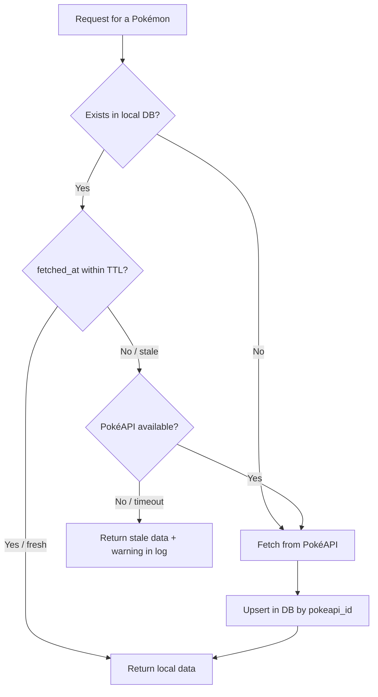

# Architecture

## Architectural Choice: Clean / Hexagonal Architecture

The project follows the principles of **Clean Architecture** (Robert C. Martin) with influences from **Hexagonal Architecture** (Ports & Adapters — Alistair Cockburn). The central rule is the **Dependency Rule**: dependencies always point inward — outer layers depend on inner layers, never the other way around.

```
Presentation → Application → Domain ← Infrastructure
```

The **Domain** layer is the core: it contains entities, ports (interfaces), and exceptions, and **imports nothing from NestJS, TypeORM, or any external framework**. This allows testing business logic with simple mocks, without needing a running database or HTTP server.

### Why this architecture?

| Decision | Alternative considered | Reason for choice |
|---|---|---|
| Clean / Hexagonal | Simple MVC (controller → service → repository) | Clearly separates business rules from infrastructure details. Use cases are testable with mocks, without any framework. |
| Ports as interfaces in Domain | Inject TypeORM repository directly into use case | The use case doesn't know TypeORM or PostgreSQL exist. Swapping the database doesn't require touching business logic. |
| Use Cases as single-responsibility classes | NestJS services with multiple responsibilities | Each use case does one thing. Easy to read, test, and evolve without fear of breaking another flow. |
| Domain exceptions as pure TypeScript classes | Throwing NestJS `HttpException` inside the domain | The domain doesn't know HTTP exists. The `GlobalExceptionFilter` in the Presentation layer maps them to status codes. |

---

## Folder Structure

```
src/
├── domain/                        # Core — zero framework dependencies
│   ├── trainer/
│   │   ├── trainer.entity.ts
│   │   ├── trainer.repository.port.ts
│   │   └── value-objects/cep.vo.ts      # CEP validation via pure regex
│   ├── team/
│   ├── pokemon/
│   │   ├── pokemon.entity.ts
│   │   ├── pokemon-type.entity.ts       # Type effectiveness cache
│   │   └── pokemon.repository.port.ts
│   ├── team-pokemon/
│   ├── ports/
│   │   ├── pokeapi.port.ts              # Interface for PokéAPI
│   │   └── viacep.port.ts               # Interface for ViaCEP
│   └── exceptions/                      # Pure error hierarchy
│
├── application/                   # Use cases — orchestrate domain and ports
│   ├── ports/                      # Cross-cutting application ports
│   ├── trainer/use-cases/
│   ├── team/use-cases/
│   └── pokemon/use-cases/
│
├── infrastructure/                # Adapters — implement domain ports
│   ├── di/tokens.ts                # Adapter and port composition tokens
│   ├── database/
│   │   ├── typeorm/
│   │   │   ├── entities/            # ORM entities (@Entity, @Column)
│   │   │   ├── repositories/        # Implement RepositoryPort
│   │   │   ├── mappers/             # OrmEntity ↔ DomainEntity
│   │   │   ├── *-persistence.module.ts # Nest bindings for TypeORM adapters
│   │   │   └── migrations/          # TypeORM migrations (synchronize: false)
│   │   └── data-source.ts           # DataSource for migrations CLI
│   ├── config/                      # Configuration adapters
│   ├── http-clients/
│       ├── pokeapi/                 # Implements PokeApiPort
│       └── viacep/                  # Implements ViaCepPort
│   ├── logging/                     # Logging adapter
│   └── modules/                     # Nest composition of use cases via factories
│
├── presentation/                  # Controllers, DTOs, Guards, Filters
│   ├── trainer/
│   ├── team/
│   ├── pokemon/
│   └── health/
│
└── shared/
    ├── filters/global-exception.filter.ts   # DomainException → HTTP
    ├── guards/api-key.guard.ts
    ├── pipes/validation.pipe.ts
    └── interceptors/logging.interceptor.ts
```

### Test co-location

Unit and integration tests live **next to the files they test**, not in a separate `test/` folder:

```
src/application/trainer/use-cases/create-trainer.use-case.ts
src/application/trainer/use-cases/create-trainer.use-case.spec.ts   ← unit test

src/infrastructure/database/typeorm/repositories/trainer.typeorm-repository.ts
src/infrastructure/database/typeorm/repositories/trainer.typeorm-repository.int-spec.ts   ← integration test
```

E2E tests (full HTTP flow) live in `test/e2e/`.

---

## Layers — Diagram

```mermaid
flowchart TD
    subgraph PRESENTATION["Presentation Layer (Controllers + DTOs)"]
        TC[TrainerController]
        TEC[TeamController]
        PC[PokemonController]
        HC[HealthController]
    end

    subgraph APPLICATION["Application Layer (Use Cases)"]
        CT[CreateTrainerUseCase]
        GetT[GetTrainerUseCase]
        UT[UpdateTrainerUseCase]
        ECE[EnrichTrainerCepUseCase]
        DTR[DeleteTrainerUseCase]
        RRT[RestoreTrainerUseCase]

        CTE[CreateTeamUseCase]
        GetTE[GetTeamUseCase]
        UTE[UpdateTeamUseCase]
        DTE[DeleteTeamUseCase]
        APT[AddPokemonToTeamUseCase]
        RPT[RemovePokemonFromTeamUseCase]
        ATA[AnalyzeTeamTypesUseCase]

        GOP[GetOrFetchPokemonUseCase]
        GOT[GetOrFetchTypeUseCase]
        LP[ListPokemonUseCase]
    end

    subgraph DOMAIN["Domain Layer (Entities + Ports)"]
        TE[TrainerEntity]
        TME[TeamEntity]
        PE[PokemonEntity]
        TRP[TrainerRepositoryPort]
        TMP[TeamRepositoryPort]
        PP[PokemonRepositoryPort]
        VP[ViaCepPort]
        PAP[PokeApiPort]
        ERR[DomainExceptions]
    end

    subgraph INFRASTRUCTURE["Infrastructure Layer (Adapters)"]
        TORM[TrainerTypeOrmRepository]
        TEORM[TeamTypeOrmRepository]
        PORM[PokemonTypeOrmRepository]
        VIAC[ViaCepClient]
        PKAPI[PokeApiClient]
        PG[(PostgreSQL)]
        VCEP[ViaCEP API]
        PKEXT[PokéAPI]
    end

    TC --> CT & GetT & UT & ECE & DTR & RRT
    TEC --> CTE & GetTE & UTE & DTE & APT & RPT & ATA
    PC --> GOP & LP
    HC --> PG

    CT & GetT & UT & DTR & RRT --> TRP
    ECE --> TRP
    ECE --> VP
    CTE & GetTE & UTE & DTE & ATA --> TMP
    APT & RPT --> TMP
    APT & GOP & LP --> PP
    ATA --> GOT
    GOT --> PAP
    GOT --> PP

    TRP -.-> TORM
    TMP -.-> TEORM
    PP -.-> PORM
    VP -.-> VIAC
    PAP -.-> PKAPI

    TORM & TEORM & PORM --> PG
    VIAC --> VCEP
    PKAPI --> PKEXT
```



> Solid arrows → direct dependency. Dashed arrows → dependency inversion via interface (Port).

---

## Cache Strategy — PokéAPI



- **Configurable TTL** via `POKEMON_TTL_HOURS` (default: 24h)
- **Resilient fallback**: if PokéAPI is down but local data exists (even expired), the API returns the stale data with a log warning — never a 503. A 502 only occurs if there is no local data at all.
- **Upsert by `pokeapi_id`**: idempotent — fetching the same Pokémon twice creates no duplicates.
- **Type cache** (`POKEMON_TYPES`): type effectiveness for the `/analysis` endpoint has its own 7-day TTL (`POKEMON_TYPE_TTL_DAYS`) — types change very rarely.

---

## Key Libraries and Decisions

| Library | Version | Decision |
|---|---|---|
| `@nestjs/core` | 10 | Main framework — provides DI, modules, guards, interceptors, and pipes with clear conventions. |
| `typeorm` | 0.3 | ORM per requirement. `synchronize: false` in all environments — schema evolves exclusively via versioned migrations. |
| `axios` | — | HTTP client for PokéAPI and ViaCEP. Configured with timeout (`HTTP_TIMEOUT_MS`) and error handling by status code, propagating to domain exceptions. |
| `class-validator` + `class-transformer` | — | DTO validation and transformation in the Presentation layer. The Domain uses its own validation (`CepVO`) without depending on any library. |
| `@nestjs/swagger` | — | OpenAPI 3.0 documentation auto-generated from decorators on controllers and DTOs. |
| `@nestjs/terminus` | — | Health check with real database connectivity verification (`GET /api/health`). |
| `@nestjs/throttler` | — | Rate limiting: 100 requests per minute per IP. |
| `helmet` | — | HTTP security headers (X-Frame-Options, X-Content-Type-Options, etc.). CSP adjusted to avoid forcing HTTP→HTTPS upgrade on localhost, preventing issues in Safari. |
| `joi` | — | Environment variable schema validation at startup. The application won't start if `API_KEYS` is empty or malformed. |
| `jest` + `ts-jest` | — | Three separate configs: unit (`jest.config.ts`), integration (`jest.integration.config.ts`), E2E (`jest.e2e.config.ts`). |
| `supertest` | — | HTTP requests in E2E tests against the full `AppModule`. |
| `pg` | — | Direct PostgreSQL driver, used in test `globalSetup` to create and drop isolated integration and E2E schemas. |

### Notable structural decisions

**`CepVO` — Pure Value Object**  
ZIP code format validation (8-digit regex) is implemented as a plain TypeScript class, without `class-validator`. The Domain doesn't know a validation library exists — the VO is fully isolatedly testable and can be reused outside the NestJS context. If validation were done only in the DTO (Presentation), the rule would be tied to the framework.

**Mappers in the Infrastructure layer**  
Conversion between `OrmEntity` (TypeORM object with `@Column` and `@Entity` decorators) and `DomainEntity` (plain POJO with business logic) happens in mappers at `infrastructure/database/typeorm/mappers/`. The Domain never sees TypeORM annotations, and Infrastructure never exposes domain objects directly to the database. This allows, for example, changing a column type in the database without touching the Domain.

**`APP_GUARD` global for API Key**  
The `ApiKeyGuard` is registered as a global guard in `AppModule`. Public routes (`/api/health` and Swagger at `/api`) receive the `@Public()` decorator for explicit opt-out. The practical consequence: any new endpoint created is protected by default, without needing to remember to add a guard — forgetting is safe.

**Migrations as the sole schema mechanism**  
`synchronize: false` in all environments, including local. The schema evolves only via versioned TypeORM migrations committed in Git. This eliminates the class of bugs where the development database silently diverges from production, and makes schema history traceable alongside the code.

---

## Domain Error Hierarchy

Exceptions are pure TypeScript classes with no framework dependencies. The `GlobalExceptionFilter` in the Presentation layer intercepts any unhandled exception and converts it to the appropriate HTTP response.

```
DomainException (abstract, extends Error)
├── TeamFullException           → 422 Unprocessable Entity
├── DuplicatePokemonException   → 409 Conflict
├── TeamArchivedException       → 422 Unprocessable Entity
├── InvalidCepException         → 400 Bad Request
└── EmailConflictException      → 409 Conflict

ResourceNotFoundException       → 404 Not Found   (extends Error directly)
ExternalServiceException        → 502 Bad Gateway  (extends Error directly)
CepNotFoundExternalException    → 404 Not Found    (extends Error directly)
```

`DomainException` groups errors caused by business rule violations — the client did something invalid. The three standalone exceptions (`ResourceNotFoundException`, `ExternalServiceException`, `CepNotFoundExternalException`) represent situations that aren't exactly "rule violated" but rather missing resources or external service problems, so they don't inherit from `DomainException`.

---

## External Integrations

| Service | Endpoint | Usage |
|---------|----------|-------|
| **PokéAPI** | `/pokemon/:name` | Fetch and cache Pokémon data |
| **PokéAPI** | `/type/:name` | Cache type effectiveness for `/analysis` |
| **ViaCEP** | `/:cep/json/` | Address enrichment by ZIP code (Brazilian addresses only) |

---

## Database

- `synchronize: false` in all environments — migrations only
- Soft delete (`deleted_at`) on Trainers and Teams via `@DeleteDateColumn`
- Partial unique index on `trainers(email) WHERE deleted_at IS NULL` — allows restore without email conflict
- `UNIQUE(team_id, pokemon_id)` and `UNIQUE(team_id, slot)` on `team_pokemon`
- See full model and modeling decisions in [[Database-ERD]]
