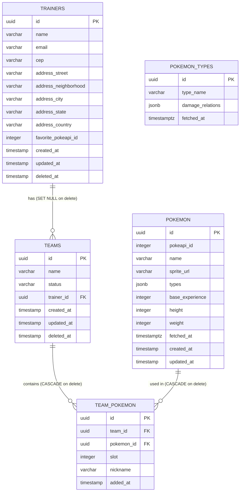

# Database Model (ERD)

---

## Modeling Decisions

### TRAINERS

| Field / Constraint | Decision |
|---|---|
| `deleted_at` | Soft delete via TypeORM's `@DeleteDateColumn`. The record is never physically removed — only marked with the removal date. This preserves history and allows restore. |
| Partial unique index on `email WHERE deleted_at IS NULL` | Ensures email uniqueness only among active trainers. An email "released" by soft delete can be reused, and the original trainer can be restored without conflict. Partial index instead of a simple `UNIQUE` because the database needs to ignore already-deleted records. |
| `favorite_pokeapi_id` integer without FK | Reference to the PokéAPI numeric ID, not the internal `id` of the `POKEMON` table. This allows a trainer to favorite a Pokémon that hasn't been cached locally yet — just fetch it via `GET /pokemon/:id` when needed. A FK would require the Pokémon to exist first, breaking the cache-on-demand model. |
| `address_country` always `"BR"` | The ViaCEP integration only covers Brazilian addresses, so the country is always Brazil. The field exists to keep the address model complete and structured, making future expansion to other countries possible without a schema migration. |
| `address_state` varchar(2) | State abbreviation returned by ViaCEP (e.g., `"SP"`, `"RJ"`). Fixed 2-character length. |

### TEAMS

| Field / Constraint | Decision |
|---|---|
| `deleted_at` | Soft delete. Teams can be deleted independently or in cascade when the trainer is deleted. The `deleted_at` identical to the trainer's is used to distinguish the two situations during restore (see [[Business-Rules]]). |
| `trainer_id FK ON DELETE SET NULL` | If a trainer is removed via direct SQL (outside application logic), the teams lose the reference but are not deleted. In practice, the application always manages this via soft delete — SET NULL is a safeguard at the database layer. |
| `status: 'active' \| 'archived'` | Archived teams don't accept new Pokémon. The default value is `'active'`. Archiving is different from deleting: an archived team is still visible and listed, it just doesn't accept additions. |

### TEAM_POKEMON

| Field / Constraint | Decision |
|---|---|
| `UNIQUE(team_id, pokemon_id)` | Prevents the same Pokémon from appearing twice in the same team. Also validated in the application, but the database is the last line of defense. |
| `UNIQUE(team_id, slot)` | Ensures two Pokémon don't occupy the same slot within a team. The slot is automatically assigned by the use case (next available). Gaps are allowed — removing slot 3 doesn't compact slots 4 and 5. |
| `team_id FK ON DELETE CASCADE` | If a team is physically deleted, all its `team_pokemon` records are automatically removed. In practice, soft delete doesn't trigger this CASCADE — it would only happen on a physical SQL deletion. |
| `pokemon_id FK ON DELETE CASCADE` | Same reasoning: if a Pokémon is removed from the local cache, its team slots are also cleaned up. |
| `nickname` nullable | Optional field. Does not affect the Pokémon's identity in the team or any business rule. |

### POKEMON

| Field / Constraint | Decision |
|---|---|
| `pokeapi_id` UNIQUE index | Upsert key — not the `name`. Pokémon with variants (e.g., `deoxys-attack`, `deoxys-defense`) share similar names but have distinct IDs in PokéAPI. Using the numeric ID avoids ambiguity. |
| `name` index (non-unique) | Performance index for name lookups via `GET /pokemon/:nameOrId`. Not unique because variants can have similar names. |
| `fetched_at` as `timestamptz` | Stored with timezone (timezone-aware) so TTL expiration calculation is correct regardless of server timezone. Plain `timestamp` without timezone would cause subtle bugs on deployments with a different TZ from UTC. |
| `sprite_url`, `base_experience`, `height`, `weight` nullable | Not every Pokémon in PokéAPI has these fields populated. The application treats `null` as absent data without failing. |
| `types` as `jsonb` | Array of strings (e.g., `["fire", "flying"]`). JSONB allows flexible queries and avoids a join table for a simple read-only relationship. |

### POKEMON_TYPES

| Field / Constraint | Decision |
|---|---|
| `type_name` UNIQUE index | Each type (e.g., `"fire"`, `"water"`) exists once in the table. Upsert by `type_name` ensures idempotency when refreshing the cache. |
| `damage_relations` as `jsonb` | Type effectiveness structure (who deals 2x, 0.5x, 0x damage). Stored as JSONB to avoid N PokéAPI calls per `/analysis` request. Separate 7-day TTL (`POKEMON_TYPE_TTL_DAYS`) — types change much less frequently than individual Pokémon data. |
| `fetched_at` as `timestamptz` | Same reasoning as `POKEMON.fetched_at` — precise TTL calculation regardless of timezone. |
